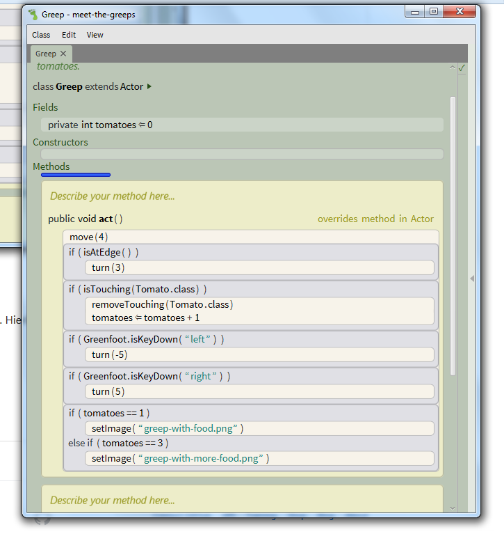
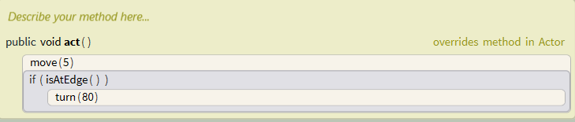
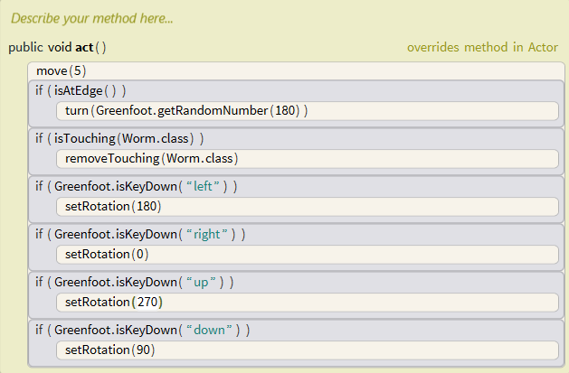
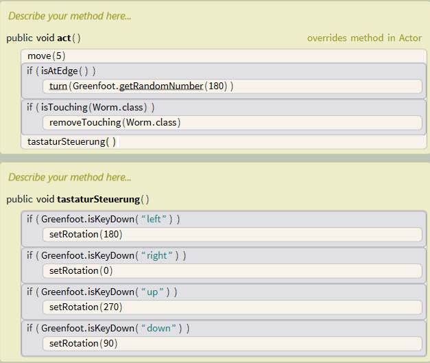

# Informatikprojekt-Nele-und-Marit
## Stundenübersicht des Informatikunterichts
[08/09/17, 1. und 2. Stunde](#1)

[13/09/17, 3. Stunde](#2)

[15/09/17, 4. und 5. Stunde](#3)

[20/09/17, 6. Stunde](#4)

[22/09/17, 7. Stunde](#5)

[04/10/17, 8. Stunde](#6)

[06/10/17, 9. und 10. Stunde](#7)

[11/10/17, 11. Stunde](#8)

[13/10/17, 12. und 13. Stunde](#9)

[1/11/17, 14. Stunde](#10)

[3/11/17, 15. und 16. Stunde](#11)

[8/11/17, 17. Stunde](#12)

## Erste und zweite Stunde (Doppelstunde)

Zu erst legten wir uns einen Github Account an. Dies war aufwendiger als wir dachten, da das Programm zunächst nicht Nele's E-Mail akzeptierte. Letztendlich hat es funktioniert.

Danach haben wir versucht das Programm Greenfoot besser verstehen und kennen zu lernen . Wir benutzten das Szenario "Leaves and Wombats" und brachten dem Wombat bei ,statt nach links nach rechts abzubiegen, wenn es auf eine Wand trifft.

## Dritte Stunde

### Wie erstelle ich einen Screenshot und füge ihn in GitHub ein?

Marit konnte aufgrund von Krankheit nicht am Unterricht teilnehmen. 

Deshalb hab ich (Nele) in unserem GitHub-Projekt die Verlinkungen zu den Stunden 1 und 2 hergestellt, und versucht einen Screenshot einzusetzen. Zunächst musste ich heraus finden wie man einen Screenshot macht. Taste: Druck/S-Abf. Danach wurde dieser in Paint geöffnet und ausgeschnitten.

## Vierte und fünfte Stunde (Doppelstunde)

Wir haben auf GitHub einen Ordner für Bilder an gelegt und einen Screenshot hochgeladen. Anschließend haben wir gelernt wie man einen Screenshot in ein Projekt einfügt:

### Greenfootprojekt 

Wir haben uns entschieden, unser Projekt mit Greenfoot umzusetzen. Der Plan war es, ein Spiel zu programmieren. Dieses sollte in einer Unterwasserwelt lokalisiert sein. der "Hauptcharakter" des Spieles sollte ein Delfin sein, welcher sich mit Hilfe der Pfeiltasten steuern lässt. Ziel des Spiels sollte es sein, den Delfin Fische fressen zu lassen, welche sich nach dem Zufallsprinzip in der Welt bewegen. Zusätlich sollte es Anker geben, die ,ebenfalls zufällig, vom oberen Rand der Unterwasserwelt (von der Wasseroberfläche) herunterfallen. Wird der Delfin von einem Anker getroffen, so hat der Spieler das Spiel verloren.

Zuerst haben wir uns den "wet-blue"-Hintergrund für unsere Welt ausgesucht und eingefügt. Sie trägt den Namen "Unterwasserwelt". Danach setzten wir mit der Funktion "new subclass" einen Fisch in unsere Welt. Durch "open editor" konnten wir mit Hilfe der Greenfoot Class Documentation unseren Fisch so programmieren, dass er sich bewegt. Hierzu benutzen wir die Methode "move (Anzahl der Schritte)".

## Sechste Stunde 
Diese Stunde wollten wir erreichen, dass sich unser Fisch dreht, wenn er am Rand der Welt ankommt.

## Siebte Stunde  
In dieser Stunde war Herr Buhl abwesend. 

Zunächst war unser Plan der Stunde den Fisch zufällig durch unsere Unterwasserwelt laufen zu lassen, was sich jedoch als schwieriger herausstellte, als wir gedacht hatten.

Wir versuchten, den Quelltext des Fisches so zu progranmmieren, das dieser sich am Rand der Welt um eine zufällige Gradzahl dreht, und dann weiterläuft. Leider schafften wir es aber nicht, die Methode "int getRandomNumber()" korrekt anzuwenden.

## Achte Stunde 
Da wir Probleme mit der Programmierung unseres eigenen Projektes hatten, haben wir uns dazu entschlossen, uns mit Hilfe eines festgelegten Lernprogrammes ersteinmal einige Grundlagen anzueignen. Dieses Lernprogramm bestand aus mehreren Lernaktivitäten.

### Lernaktivität eins

#### Aufgabe eins:

Der Greep bewegt sich nach rechts und läuft an den Tomaten vorbei.

#### Aufgabe zwei:

Der Greep dreht sich auf der Stelle.

#### Aufgabe drei:

Der Greep dreht sich im Kreis.

#### Aufgabe vier:

Der Greep erhält den Befehl, sich geradeaus zu bewegen. Sobald er den Rand der Welt erreicht, erhält er den Befehl, sich zu drehen. Sobald die Bedingung "Greep befindet sich am Rand der Welt" nicht mehr erfüllt ist, bewegt der Greep sich wieder geradeaus.

#### Aufgabe fünf:

Wir fügen eine weitere Bedingung hinzu: Wenn der Greep eine Tomate berührt, so soll diese entfernt (vom Greep gefressen) werden.

#### Unser Stand am Ende der Stunde:

## Neunte und zehnte Stunde  (Doppelstunde)

#### Aufgabe sechs:

Wir lassen den Greep mithilfe der Pfeiltasten drehen, indem wir unter die "act" Mehode die Befehle "if (Greenfoot.isKeyDown("left"))" und "if (Greenfoot.isKeyDown("right"))" einfügen, und den Greep jeweils um 5, beziehungsweise -5 Grad drehen lassen. 

#### Aufgabe sieben:

Zunächst haben wir wie gefordert den Befehl "private int tomatoes <=0" dem Abschnitt "Fields" hinzugefügt. Damit die gefressenen Tomaten auch gezählt werden, mussten wir den Befehl "tomatoes <= tomatoes +1" unter dem Abschnitt "if (isTouching(Tomato.class))" der "act" Methode hinzufügen.

#### Aufgabe acht:

Wir haben den Befehl unter der "act" Methode eingesetzt. Hierbei ist es egal, ob er sich direkt bei den anderen Befehlen, die mit den Tomaten zusammenhängen, befindet, oder nicht.

### Lernaktivität zwei

#### Aufgabe eins:

Öffnet man das "CheatSheet", so erscheint eine Liste von möglichen Kommandos, und entsprechenden Kurzbefehlen (-> Hotkeys).

#### Aufgabe zwei:

Benutzt man einen der Hotkeys, so erscheint das jeweilige Kommando, samt eines Eingabefeldes in der "act" Methode. Drückt man "escape", so verschwindet die Kommandospalte wieder. Gibt man einen Text in das Eingabefeld ein und drückt dann auf "escape", so passiert gar nichts.

Markiert man den gesamten eingegebenen Text und drückt "backspace", so verschwindet der eingegebene Text, dass Kommando bleibt und lässt sich nun wieder mit "escape" entfernen.

#### Aufgabe drei:

Wählt man die beiden Befehle "move" und "turn" aus, und wählt "disable", so bewegt sich die Katze gar nicht mehr, wenn man "act" drückt. Wählt man nun "enable", so dreht sie sich wieder im Kreis.

#### Aufgabe vier:

Unter "inherited from actor" findet man alle Methoden, die die Klasse "actor" ausführen kann, wie beispielsweise die Methode "move".

Unter "inherited from cat" findet man Methoden, die speziell für die Katze programmiert worden sind, wie beispielsweise "is hungry".

## Elfte Stunde  

#### Aufgabe vier (Fortsetztung):

Unter dem Pfeilkopf in der Klassendefinition sind die gleichen Methoden aufgelistet, wie vorhin unter "inherited from actor", beziehungsweise "inherited from cat".

Unter der "birds eye view" im Stride-Quelltext findet man die Methoden, die auch unter "inherited from cat" zu finden sind.

#### Aufgabe fünf:

Wir haben einen neuen Methodenaufruf geöffnet. Drückt man nun "Steuerung" und "Space", so öffnet sich ein Menü mit allen Methoden, aus denen man auswählen kann.

Wählt man nun den Buchstaben "i", so reduziert sich die Auswahl der möglichen Methoden auf alle diejenigen, die mit einem "i" anfangen.

## Zwölfte und dreizehnte Stunde  (Doppelstunde)

### Lernaktivität drei

#### Aufgaben eins bis fünf:

Wir haben die Katze essen, schlafen und tanzen lassen, indem wir die entsprechenden Befehle (eat(), sleep(how long), dance()) in der act-Methode hinzugefügt haben.

Wir haben uns eine eigene Routine für die Katze überlegt. Diese besteht daraus, "Hooray!" zu rufen, sich schlafen zu legen, sich dabei einmal um sich selbst zu drehen, und anschließend noch einmal "Hooray!" zu rufen.

#### Aufgaben sechs bis acht:

Wir sollten die Katze mit Hilfe eines if-Befehls tanzen lassen, wenn sie gelangweilt ist, und schlafen lassen, falls sie müde ist.

Die Katze befolgt nun zusätzlich den Befehl, wenn sie hungrig ist, ein Stück Pizza zu essen.

#### Aufgaben neun bis zehn:

Die Aufgabe war es, die Katze schlafen zu lassen, falls sie müde ist. Anschließend sollte sie "Hooray!" rufen. Wenn sie nicht müde ist, sollte sie nur "Hooray!" rufen. Um die Katze müde zu machen, kann man sie tanzen lassen. Dies funktioniert mit einem Rechtsklick auf die Katze, dann kann man unter "inherited from actor" die Methode "dance" auswählen.

Soll die Katze schlafen, wenn sie alleine ist, und "Hooray!" rufen, sobald sie Gesellschaft hat, muss man in der act- Methode folgende Befehle und Bedingungen einsetzen:

### Lernaktivität vier

#### Aufgabe:

Wenn man die Krabbe in der Welt speichert, so erscheint im Quelltext zusätzlich zu der Beschreibung der Welt noch ein Methoden-Fenster:

#### Aufgabe eins bis drei:

Wir sollten die Krabbe so lange geradeaus laufen lassen, bis sie den Rand der Welt erreicht. Hier sollte sie sich um eine Gradzahl drehen, die optisch möglichst gut zu der Bewegung der Krabbe passt. Wir haben uns für 80° entschieden, da so die gesamte Welt, und nicht nur ihr Rand ausgenutzt wird.

## Vierzehnte Stunde 

### Lernaktivität fünf:

#### Aufgabe:

In dieser Lernaktivität ging es um das Erzeugen von Befehlen mit zufälligen Parametern. Die Aufgabe war es, die Krabbe mit einer Wahrscheinlichkeit von 10% um 4° drehen zu lassen. Hierzu benutzt man die Variable "getRandomNumber()". Um zu erreichen, dass die Wahrscheinlichkeit für 4° 10% beträgt, muss man lediglich den Parameter 10 eingeben. Da die jeweilige Gradzahl dann zufällig aus dem Bereich von 0°-10° ausgewählt wird, beträgt die Wahrscheinlichkeit für eine Drehung um 4° 10%.

## Fünfzente und sechzente Stunde  (Doppelstunde)

### Lernaktivität sechs:

#### Aufgabe:

Um die Krabbe einen Wurm fressen zu lassen, falls sie ihn berührt, haben wir unter der act-Methode einen neuen if-Befehl erstellt:

### Lernaktivität sieben:

#### Aufgabe eins:

In dieser Aufgabe sollte eine neue Actor-Klasse erstellt werden: Der Lobster sollte sich in unserer Welt willkürlich bewegen, und die Krabben fressen, wenn er sie berührt. Hierzu haben wir folgenden Quelltext erstellt:

  
Außerdem sollten wir den Quelltext des Lobsters so programmieren, dass er ein Geräusch von sich gibt, wenn er eine Krabbe frisst. Hierzu mussten wir zunächst das entsprechende Geräusch zu den Dokumenten im Greenfoot-Ordner hinzufügen. Als nächstes haben wir das Geräusch in den Constructor des Lobsters hinzugefügt, und ihm den Namen "frissTon" gegeben. Nun konnten wir in der act-Methode unter der if-Bedingung, dass der Lobster auf eine Krabbe trifft, den Befehl "frissTon.play" hinzufügen:

#### Aufgabe zwei:

Wir sollten die Krabbe so programmieren, dass sie sich mit den Pfeiltasten steuern lässt. Hierzu mussten wir neue if-Befehle in den Quelltext hinzufügen, die dafür sorgen, dass die Krabbe sich, wenn eine der Pfeiltatsen gedrückt wird, in die entsprechende Richtung dreht.

## Siebzente Stunde 

#### Aufgabe drei:

Um die act-Methode übersichtlicher zu gestalten, kann es sinnvoll sein, einige ihrer Teile auszulagern. Dies macht man, indem man eien neuen Methodenaufruf erstellt, und die auszulagernden Teile unter diesem Methodenaufruf hinzufügen. Dann kann man unter der act-Methode die Einzelteile des neuen Methodenaufrufes entfernen, und stattdessen den neuen Methodenaufruf hinzufügen:

